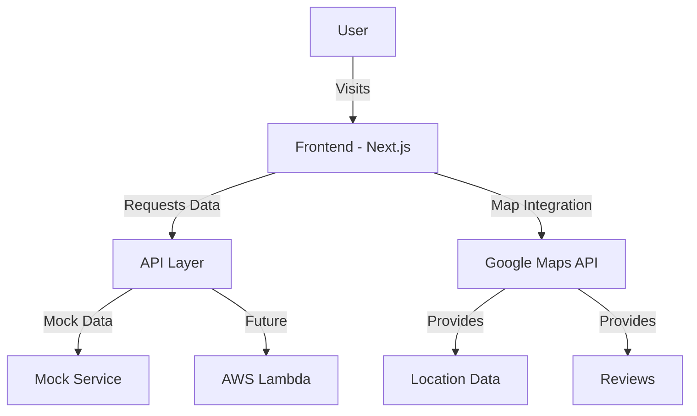

# System Patterns: Poker Ikitai

## Architecture Overview



## Component Structure

### Pages
- `app/page.tsx`: Home page with search and featured stores
- `app/stores/page.tsx`: Store listing page with search results (client-side)
- `app/stores/[id]/page.tsx`: Individual store details page (async, Promise-based params)

### Next.js 15 Page Props Pattern
For dynamic route pages with Next.js 15 and OpenNext for Cloudflare Pages, we've found that Promise-based params typing works best:

```typescript
// Most compatible approach for Next.js 15 with OpenNext/Cloudflare
export default async function StorePage({
  params,
}: {
  params: Promise<{ id: string }>;
}) {
  const { id } = await params;
  // Implementation
}
```

This approach avoids conflicts with auto-generated types and prevents TypeScript errors during build that block deployment.

### Runtime Configuration with Next.js and OpenNext

We've simplified the approach to runtime configuration by setting it globally in next.config.ts:

```typescript
// In next.config.ts - global runtime configuration
const nextConfig: NextConfig = {
  runtime: "edge",
  images: {
    remotePatterns: [
      {
        protocol: 'https',
        hostname: 'images.unsplash.com',
        pathname: '/**',
      },
    ],
  },
};
```

Key learnings for Next.js with OpenNext and Cloudflare Pages:
- Avoid complex page-level runtime configurations
- Keep OpenNext configuration minimal to prevent conflicts
- Use Promise-based params typing for dynamic routes
- Configure global runtime settings at the Next.js config level

### Components
- `components/ui/`: Shadcn UI components
- `components/layout/`: Layout components (Header, Footer, etc.)
- `components/store/`: Store-related components
  - `StoreCard.tsx`: Card display for store listings
  - `StoreFilters.tsx`: Search and filter controls
  - `StoreDetails.tsx`: Detailed store information

### Data Flow
1. User interactions with filters and search
2. React components update state based on interactions
3. Data fetching triggered by state changes through useCallback functions
4. Results displayed to user via components

## State Management

### React Component Patterns
- Using `useCallback` for stable function references in effect dependencies
- Proper dependency arrays in useEffect to prevent stale closures and infinite loops
- Async/await pattern in dynamic route components for proper Next.js App Router integration

### SearchFilters
```typescript
interface SearchFilters {
  openNow: boolean;
  chipPrice: [number, number] | null;
}

interface StoreFiltersProps {
  initialLocation?: string;
  initialFilters?: SearchFilters;
  initialSort?: SortOption;
  onSearch: (location: string, filters: SearchFilters, sortBy: SortOption) => void;
}
```

## Next.js App Router Implementation
- Client components marked with "use client" directive
- Server components use async/await pattern
- Dynamic routes handle params asynchronously
- Global layout provides consistent UI structure

## API Structure (Current Mock Implementation)

### API Services
- `getStoreById(id: string): Promise<PokerStore | null>`
- `searchStores(params?: SearchParams): PokerStore[]`

## Styling Approach
- Mobile-first design using Tailwind CSS
- Shadcn UI components for consistent UI elements
- Responsive layouts for all screen sizes
- Next.js Image component with proper configuration for external sources