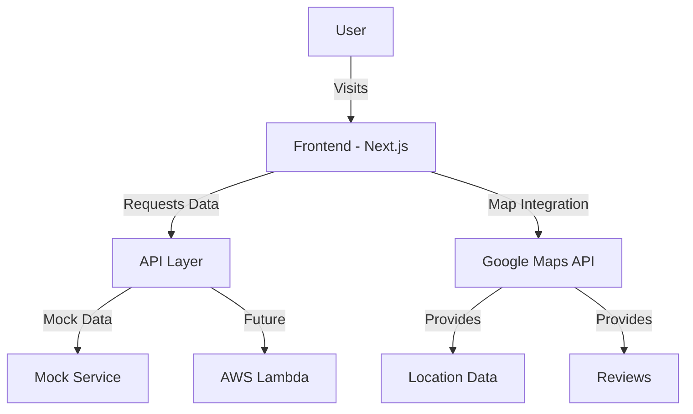

# System Patterns: Poker Ikitai

## Architecture Overview



## Component Structure

### Pages
- `app/page.tsx`: Home page with search and featured stores
- `app/stores/page.tsx`: Store listing page with search results
- `app/stores/[id]/page.tsx`: Individual store details page (async)

### Components
- `components/ui/`: Shadcn UI components
- `components/layout/`: Layout components (Header, Footer, etc.)
- `components/store/`: Store-related components
  - `StoreCard.tsx`: Card display for store listings
  - `StoreFilters.tsx`: Search and filter controls
  - `StoreDetails.tsx`: Detailed store information

### Data Flow
1. User interactions with filters and search
2. React components update state based on interactions
3. Data fetching triggered by state changes through useCallback functions
4. Results displayed to user via components

## State Management

### React Component Patterns
- Using `useCallback` for stable function references in effect dependencies
- Proper dependency arrays in useEffect to prevent stale closures and infinite loops
- Async/await pattern in dynamic route components for proper Next.js App Router integration

### SearchFilters
```typescript
interface SearchFilters {
  openNow: boolean;
  chipPrice: [number, number] | null;
}

interface StoreFiltersProps {
  initialLocation?: string;
  initialFilters?: SearchFilters;
  initialSort?: SortOption;
  onSearch: (location: string, filters: SearchFilters, sortBy: SortOption) => void;
}
```

## API Structure (Future)

### Endpoints
- `/api/stores`: List all stores with optional filters
- `/api/stores/[id]`: Get details for a specific store
- `/api/search`: Search stores with complex filtering

## Styling Approach
- Mobile-first design using Tailwind CSS
- Shadcn UI components for consistent UI elements
- Responsive layouts for all screen sizes
- Next.js Image component with proper configuration for external sources